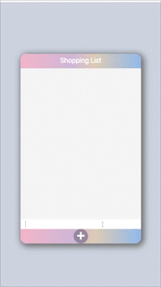

# Shopping List

## [클릭😊](https://jeong922.github.io/shopping-list/)

- 라이브러리나 프레임워크 없이 자바스크립트로 만든 쇼핑 리스트이다.(todo리스트와 비슷함)
- input을 통해 원하는 텍스트를 입력하고 키보드 Enter를 누르거나 input 아래 버튼을 이용해 원하는 텍스트를 입력할 수 있다.
- 입력한 데이터는 localStorage에 저장되도록 구현하였다.
- 쇼핑 리스트이므로 체크박스를 통해 구매 여부를 표시할 수 있게 구현하였으며 ➖ 버튼을 누르면 삭제가 가능하다.
  

  
  

